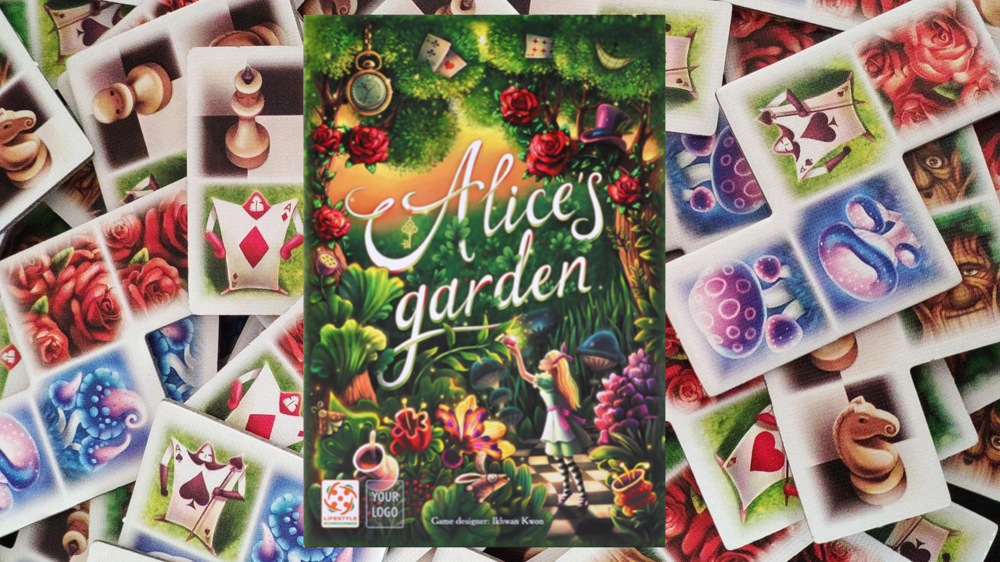

# Alice Garden Game Console

Alice Garden Game Logo

Welcome to the console version of Alice Garden Game, a project created for academic purposes. This project aims to recreate the popular game "Alice's Garden" using the C programming language and SDL2.

## About the Game

Alice Garden Game is a puzzle game where the players must decorate a garden board using tiles of different shapes. The players must use logic and problem-solving skills and optimizing to maximize their score by different ways. The game features images, full mouse input support and up to 4 players.

## Installation

To install and play Alice Garden Game Console, follow the steps below:

    Clone the repository using the following command:

Bash / Windows etc:

    git clone https://github.com/XelaRy/AliceGardenExtreme

    cd AliceGardenExtreme

Bash:

    cd AliceGardenExtreme

    gcc *.c -o Alice.exe -lSDL2 -lSDL2_image -lSDL2_ttf

Windows:

    cd AliceGardenExtreme

    make

## Usage

Run the game using the following command:

Bash / Windows etc:

    ./export/Alice.exe

Screenshots

### Alice Garden Game Screenshot 1

### Alice Garden Game Screenshot 2

## Credits

Alice Garden Game was created by :  
Alexandre R. [@xelary](https://github.com/XelaRy)  
Arnaud .M [@arnaud.MRLN](https://github.com/Arnaudmrln)

## License

Alice Garden Extreme is released under the MIT License. See LICENSE for more information.
